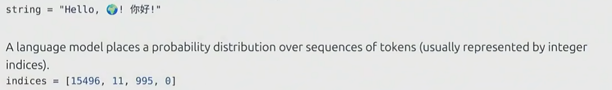

# Tokenization

## tokenization introduction

概念：获取通常表示为Unicode字符串的原始样本，并将其本质上转换为一组整数。

## tokenization examples

### **GPT-2 分词器：字符串映射到索引，索引解码得到字符串**

压缩率 = 字节数/token数（number of bytes / number of tokens）

## character tokenizer （基于字符的分词）

### 基于字符的分词的思想

每一个字符都对应了一个码数。它们是一一映射关系。相当于要为词汇表中的每个字符都平均分配一个槽位，而在这些字符里，有些字符出现的频率远高于其他字符，所以这并不是一个非常有效的利用预算的方式。

### 基于字符的分词的做法

### 基于字符的分词存在的问题

## byte tokenizer （基于字节的分词）

### 原理

Unicode strings 可以被表示成一连串的字节序列，每个字符串可以直接转换成字节，可以被0-255的整数表示，如图。

### 最常见的Unicode解码方式：UTF-8

### 基于字节的分词的做法

转换成字节后，所有的索引值都会在0-255之间。

### 基于字节的分词 存在的问题

- **压缩率太差（compression ratio terrible）**
    - 一个字节对应 256 个可能值，看起来很简单，但实际上 **没有压缩**。
    - 文本会被拆成非常长的序列（因为没办法用更少的 token 表达更多语义）。
- **序列太长（sequences will be too long）**
    - 压缩率低意味着输入序列膨胀。
    - 例如，同一句话如果用 subword（子词分词）只需要几十个 token，但字节分词可能要几百个。
- **Transformer 的上下文长度有限**
    - 注意力机制是 **二次复杂度 O(n²)**，序列过长会导致计算成本非常高。
    - 所以字节分词会让 **计算更慢、更贵**，不利于在有限算力下训练大模型。

## word tokenizer （基于词语的分词）

### 基于字节的分词的做法

有一个字符串，利用正则表达式把它分成一个片段序列。然后给每个片段（token）分配一个索引即可。

### 基于字节的分词 存在的问题

- **词表规模巨大**
    - 例如 Unicode 字符覆盖范围非常大，导致词表非常庞大，难以管理。
- **长尾词问题**
    - 许多词非常罕见，模型在训练中几乎学不到它们的表示。
- **无法提供固定大小的词表**
    - 新词、专有名词、错别字等在训练时未出现，词表里没有对应 token。
- **UNK token 问题**
    - 遇到新词时，会被替换成特殊的 **UNK（未知词）token**。
    - 这样不仅丢失信息，还会让 **困惑度（perplexity）计算不准确**，影响模型评估。

## Byte pair tokenizer （基于字节对的分词）

### BPE的做法

BPE 算法的训练过程可以概括为以下步骤：

1. **初始化**： 从文本的每一个字节开始，将其视为一个词元。
2. **迭代合并**： 持续迭代进行以下操作：
    - 找出训练数据中相邻词元对中出现频率最高的那一对。
    - 将这一对最常见的相邻词元对合并成一个新的词元。
3. **停止**： 重复这个过程，直到达到预设的词汇表大小，或者最常见的相邻词元对的出现频率低于某个阈值。

简而言之，BPE就是不断地将训练文本中最常见的相邻字符或词元对合并成新的词元，直到达到所需的词汇表大小。

- 著名的模型如 **GPT-2** 也使用了 BPE 进行**词元化（Tokenization）**。
- **GPT-2 论文**中提到，他们先使用**基于词（word-based）的词元化**将文本拆分成初始片段，然后对**每个片段**运行**原始的 BPE 算法**。

### BPE算法具体流程

例子：

### BPE 在 NLP 中的应用

- BPE 最初是在 **1994 年**被 **Philip Gage** 提出用于**数据压缩**的。
- 后来它被**改编**用于 **NLP** 中的**神经机器翻译**。
- 著名的模型如 **GPT-2** 也使用了 BPE 进行**词元化（Tokenization）**。
- **GPT-2 论文**中提到，他们先使用**基于词（word-based）的词元化**将文本拆分成初始片段，然后对**每个片段**运行**原始的 BPE 算法**。

## Summary

