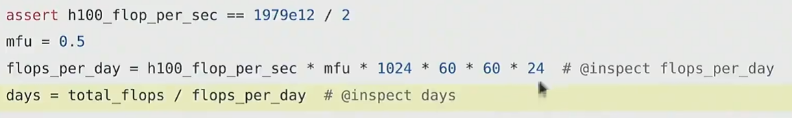

# 利用pytorch构建大模型

如何使用数学推理估算出训练时间？

**Question1：**How long would it take to train a 70B parameter model on 15T tokens on 1024 H100s？（训练一个700亿参数的密集型transformer需要多久，在15万亿个token上，使用1024个H100）




使用AdamW，能在8张H100s上训练的最大模型是多大？ 

1. H100有80GB的显存
2. 参数、梯度和优化器状态每个参数需要16个字节
3. 参数总量 = 总显存量/每个参数所需的字节数
4. 没有考虑激活值

# Memory accounting

## 张量基础

张量是存储深度学习一切的基础构建块。可存储参数、梯度、优化器状态、数据等。

### 常见的创建张量的一些方法


## 张量占用内存

几乎所有的数据都是用浮点数存储，例如参数、梯度、激活值等。

## 浮点数

float32训练稳定，但会占用大量内存。

float16、fp8虽然内存占用少，但可能会出现训练不稳定的情况。

针对不同的参数的需求，选择不同的数据类型，可以采用混合精度训练。

### float32（最默认方式）（又被称为FP32或单精度）


1位用于符号，8位用于指数，23位用于尾数。32位，故一个float32占用4个字节。

**结果发现，对于存储优化器状态和参数，仍然需要FP32，否则会导致训练不稳定。**

### float16（称为半精度，因为其相对float32能够把内存用用量减少一半）


1位用于符号，5位用于指数，10位用于尾数。16位，故一个float16占用2个字节。

**缺点：**动态范围不好，不适合表示非常小和非常大的数，也即遇到特小或者特大的数，可能会出现上溢下溢，例如：


### bfloat16


给指数部分分配了更多位，给小数部分分配了更少位。

**目的：**使得其拥有更大的动态范围（扩大指数位），只需要float16的空间就能够拥有float32的动态范围。

**缺点：**由于减少了小数部分的位数，所以精度会更差，也就是分辨率会更差，但这对于深度学习来说没这么重要。

### fp8


拥有两种变体，根据对分辨率和动态范围的需要选择。

需要更大的动态范围则选择FP8 E5M2，反之。

 

## 张量内存占用计算

张量所占用内存取决于：

1. 张量里元素的数量
2. 每个元素的数据类型

**例子：**


## 张量计算

默认情况，张量是存储在cpu中的，会存在cpu的内存（RAM）里。


# Compute accounting

## 张量的底层原理和公用机制

### 底层原理

在pytorch里张量实际上是指向已分配内存的一些指针


每个维度一个步长，strides[1]=1，strides[0]=4，这样可以定位。

strides[0]的意思是，如果想增加该维度的索引（在这里是跳到下一行），需要跳过多少元素，在这里0如果要跳到4，需要跳过4个元素。

### 张量的公用机制和一些函数

很多操作并不会创建新的张量，而是在张量原先的空间上创建了一个不同视图，对一个张量操作，会导致另外一个张量改变。（两个张量公用一个存储空间）

例如：


在这里，y和x的第0行其实在底层是公用一个存储空间的。

**View 3x2 matrix as 2x3 matrix：**

可以调用view函数，接受任何张量，并看作其他张量，例如：


**这个操作**也**不会改变数据**或进行复制。

**Transpose the matrix（仍然不会复制数据）**


这里X和Y都是指向同一块底层存储空间的指针。

`view()` 只能作用在**连续（contiguous）内存块**


当张量在内存中的数据按照自身 shape 能逐元素顺序访问、无需跳跃时，就是连续内存（contiguous）；一旦像 transpose 这种操作打乱访问顺序，就变成非连续内存。

**contiguous操作和reshape操作（可能会复制数据）**

如果使用contiguous函数，会复制一个copy，这个时候X和Y不再指向同一个内存空间。


### 逐元素操作

会创建新的张量


### 三角运算


可用于**因果注意力掩码。**

### 矩阵乘法


这里x@w，假设x的维度分别为，batch_size,token,token_dim1,token_dim2

这里x@w的矩阵运算可以理解为对于每个批次，每个token，token_dim1,token_dim2和w做矩阵乘法。

## tensor_einops

### einops_einsum（这个方法使得矩阵乘法更清晰）

命名所有的维度，而不是只利用索引

**JAX typing使得我们可以定义维度的名字**


**定义数据**


**旧的矩阵乘法：**


**einops的做法**


任何未在输出结果中命名的维度都会被求和

任何被命名的维度都会被遍历

**einops扩展**


可以使用 … 来表示对任意数量的维度进行广播

### einops_reduce（reduce操作只作用于一个张量）

**定义数据**


**传统做法**


**einops做法**


消失的维度hidden，也就是聚合的维度。

### einops_rearrange


## tensor_operations_flops（张量计算成本）

浮点操作是指任何设计浮点数的运算，包括加法或乘法等。


FLOPs表示浮点操作次数，衡量完成的计算量

FLOPS用来衡量硬件的速度，每秒浮点运算次数

A100的峰值性能为每秒312 teraFLOP/s

H100的峰值性能为每秒1979 teraFLOP/s

并且这些每秒浮点运算次数取决于数据的类型。因为对于同一个GPU，内存是固定的，如果数据类型所占字节更少，那么可以容纳更多的数据量，这个时候并行计算，每秒浮点运算次数也会更大，

矩阵稀疏性指的是：矩阵中绝大多数元素为 0，只有少数非零元素，所以存储和运算时可以只关心非零部分、跳过大量零值。

### 矩阵乘法的计算量


（B,D）(D,K) 相乘，得到（B,K）矩阵

对于（B,K）矩阵的每一个元素，生成该元素都需要D次乘法和D-1次加法，约为2*D次运算。而（B,K）矩阵的大小为B*K，故总共需要2*B*D*K次浮点运算。

如果将B看作数据点个数，(D,K)看作参数数目，那么前向过程所需要的FLOPs就是2*（num of tokens）*（num of parameters）

### FLOPs of other operations（其他操作的浮点运算次数）

- FLOPs of other operations通常与矩阵或张量大小呈线性关系。

### Model FLOPs utilization（MFU）

定义：actual FLOP/s / promised FLOP/s（实际浮点运算次数/承诺的浮点运算次数）（忽略了通信等开销）

MFU≥0.5通常被认为是好的。 

## gradients_basics 梯度

考虑一个简单的模型：


**考虑一个复杂的模型（两层线性模型）**


**前向传播**的计算量:（2*B*D*D）+（2*B*D*K）


**反向传播**的计算量，这里需要考虑


举个例子，计算**w2的梯度**。


w2.grad[j,k] = sum_i h1[i,j] * h2.grad[i,k](这里运算了2*B-1次，因为对于每个i，都进行了一次乘法，一共要B次乘法，然后还要全部加到w2.grad[j,k]上面去，要进行B-1次加法，故运算的总次数为2*B-1)

在这里i是指第一个维度，类似于batch_size。

第一个维度的维度大小为B，故对于w2这个矩阵（D*K），每一个样本i，计算w2的梯度，要进行D*K次运算（每一个元素的梯度都需要B次乘法运算，B-1次加法运算，w2一共有D*K个元素），一共有B个样本，故对于一个参数W2，所需要的总的计算量为2*B*D*K。

**h1的梯度同理（h1的梯度是中间量，是为了求w2的梯度才需要计算h1的梯度的）**


故对于w2这个参数来说，总的计算量为4*B*D*K

**W1的梯度同理**


对于W1这个参数来说，总的计算量为（2+2）*B*D*D，因为W1的维度是D*D

**总结**

- 正向传播的计算量是2*（nums of data）*（nums of parameters）FLOPs
- 反向传播：4*（nums of data）*（nums of parameters）FLOPs
- Total：6*（nums of data）*（nums of parameters）

# Models

## module_parameters


在pytorch里，参数被存储为parameter对象。

### 参数初始化

假设输入维度16384，输出维度32，输出的数值方差与输入特征数的平方根有关。这会导致数值发散，并且训练非常不稳定。

- **原因**
    
    
    
    
    
    
    
    
    

为了避免以上情况，通常会重新归一化，通过除以输入维度的平方根。常数意义上来讲，这个也算一种Xavier标准化。


如果想进一步使得数值变得安全，还可以对输出值进行截断。


## custom_model

利用nn.parameter构建一个简单的深度线性模型

设计略

**可复现性**

由于很多时候参数初始化、dropout层、数据选择等都是随机的。所以为了模型的可复现性，强烈建议为每个随机的来源设置不同的随机种子，这样确保尽可能可以复现模型效果。


## data loading


有时，模型的数据会很大，并不能一次性将所有的数据加载至内存，使用memmap可以假装将数据读入了内存，当需要访问数据时，实际上会按需加载文件，这相当于是将数据存储在文件中。使用 memmap 后，可以轻松创建一个指向这个 50GB 文件的“数组视图”。可以通过memmap返回的对象进行读取、计算、修改文件中的任何部分，而完全不需要 50GB 的空闲内存。操作系统会自动处理数据在硬盘和内存之间的交换。


并且利用这个memmap返回的对象，我们可以对其操作进行dataloader的装载。


## optimizer

### 常见的优化器：


### 实现一个优化器

优化器的step功能，此处重写了一个adaGrad的优化步骤：


首先，对参数进行分层，获取每一层参数此时累积的grad平方的状态值，根据AdaGrad定义的算法，对这个状态值进行更改，然后重新写入当前参数的状态里，并且根据算法定义，利用学习率和梯度等值更新数据。

在优化步骤结束后，可以释放内存：


### 优化器状态的内存需求

对于之前作者定义的例子：


一共有64个维度，2层线性层，并且每一个线性层都是64个维度。

**要存储的数据**

模型的参数数目:


激活值数目（对于每个样本都有D*num_layers个激活值，有B个样本）：


梯度（模型的参数梯度个数=模型的参数个数）：


优化器状态：


总体来看，若采用FP32（4字节），那么

total_memory = 4*(num_parameters + num_activations + num_gradients + num_optimizer_states)

### Compute(for one step)

flops = 6*B*num_parameters

**有关transformer的计算**

Blog post describing memory usage for Transformer training:https://erees.dev/transformer-memory/

Blog post descibing FLOPs for a Transformer:

https://www.adamcasson.com/posts/transformer-flops

## checkpointing

需要保存的东西包括模型和优化器

```python
model = Cruncher(dim=64, num_layers=3).to(get_device())
    optimizer = AdaGrad(model.parameters(), lr=0.01)

    note("Save the checkpoint:")
    checkpoint = {
        "model": model.state_dict(),
        "optimizer": optimizer.state_dict(),
    }
    torch.save(checkpoint, "model_checkpoint.pt")

    note("Load the checkpoint:")
    loaded_checkpoint = torch.load("model_checkpoint.pt")
```

## mixed_precision_training 混合精度训练

Choice of data type (float32, bfloat16, fp8) have tradeoffs.

- Higher precision: more accurate/stable, more memory, more compute
- Lower precision: less accurate/stable, less memory, less compute


pytorch关于混合精度的文档

https://pytorch.org/docs/stable/amp.html

https://docs.nvidia.com/deeplearning/performance/mixed-precision-training/

**经验：**训练时通常采用高精度，低精度数据类型是很难进行训练的，但是一旦通过训练得到了一个模型，此时可以大胆进行模型的量化，也就是推理阶段可以尝试不同的低精度数据类型，提升模型的性能。