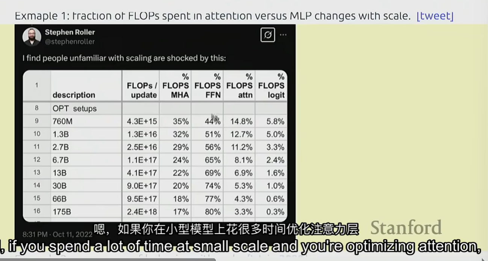

# 大模型概述

# basics

### Fraction of FLOPs spent in attention versus MLO changes with scale

对于transformer架构，随着参数的扩大，MLP的计算量逐渐占主导地位。参数少时MLP计算量和多头注意力计算量相当。这意味着随着参数量的增大，优化MLP的作用也会愈发明显。

### Emergence of behavior with scale(参数规模增大存在涌现行为)

可以看到，随着参数量的增大，在一定的增大范围内，因变量是几乎没有变化的，当参数量增大到某一范围后，因变量会开始出现突增的情况。

### 学习大模型的思路

1. 了解大模型工作的原理，大模型是如何并行利用GPU计算的等。
2. 尽可能将硬件利用率使用到极限，并且需要考虑模型的可扩展性。
3. 针对特定的任务，使用什么样的数据和建模决策能产生好的模型。

### 模型的精度

错误的思考：参数规模最重要，算法并不重要

正确：规模化算法是关键

模型精度 = efficiency * resources

efficiency = 硬件+算法

效率在规模大的模型里要重要的多得多，否则效率低下会浪费资源和钱

## 大语言模型的历史背景

### before 2010s

- 香农将语言模型视为一种用来估算英语熵的方法
- 很多N-gram的大语言模型工作

### 2010s

- 第一个大语言模型（神经网络概率语言模型）https://jmlr.org/papers/volume3/bengio03a/bengio03a.pdf
- 序列到序列模型（用于机器翻译）https://arxiv.org/abs/1409.3215
- Adam优化器的提出https://arxiv.org/abs/1412.6980
- 注意力机制的提出 https://arxiv.org/abs/1409.0473
- Transformer architecture https://arxiv.org/abs/1706.03762
- Mixture of experts（专家混合模型）https://arxiv.org/abs/1701.06538
- 如何本质上实现模型并行化 https://arxiv.org/abs/1811.06965 https://arxiv.org/abs/1910.02054

### Early foundation models(late 2010s)

核心思想：用大量文本进行训练并适应各种下游任务（微调）

相关工作：

- ELMo：pretraining with LSTMs，fine-tuning helps tasks https://arxiv.org/abs/1802.05365
- BERT：pretraining with Transformer，fine-tuning helps taskshttps://arxiv.org/abs/1810.04805
- Google‘s T5(11B)：cast everything as text-to-text https://arxiv.org/abs/1910.10683

### Embracing scaling，more closed（封闭的模型，只能用API访问，没有开源）

- OpenAI’s GPT-2（1.5B）：fluent text，first signs of zero-shot，staged release https://github.com/openai/gpt-2?tab=readme-ov-file https://d4mucfpksywv.cloudfront.net/better-language-models/language_models_are_unsupervised_multitask_learners.pdf
- Scaling laws：provide hope/predictability for scaling https://arxiv.org/abs/2001.08361
    
    规模化法则行为的关键因素如下：
    
    - 模型大小：随着模型中参数数量的增加，性能通常会按照幂律改善。
    - 数据集大小：更大的训练数据集通常带来更好的性能，也遵循幂律关系。
    - 计算：用于训练的计算资源（浮点运算次数）与性能改善相关。
- OpenAI‘s GPT-3 （175B）：in-context learning，closed https://arxiv.org/abs/2005.14165
- Google’s PaLM（540B）：massive scale，undertrainedhttps://arxiv.org/abs/2204.02311
- DeepMind‘s Chinchilla（70B）：compute-optimal scaling laws https://arxiv.org/pdf/2203.15556

### Open models（开放模型，发布了权重）

- EleutherAL’s open datasets（the pile）and models（GPT-J）
    
    https://pile.eleuther.ai/ 
    
    https://github.com/EleutherAI/the-pile?tab=readme-ov-file 
    
    https://www.eleuther.ai/artifacts/gpt-j
    
- Meta’s OPT（175B）：GPT-3 replication，lots of hardware issues
    
    https://ai.meta.com/blog/democratizing-access-to-large-scale-language-models-with-opt-175b/
    
- Hugging Face/BigScience‘s BLOOM：focused on data sourcing https://huggingface.co/bigscience/bloom
- Meta’s Llama models
    
    https://arxiv.org/abs/2302.13971
    
    https://arxiv.org/abs/2307.09288
    https://arxiv.org/abs/2407.21783
    
- Alibaba’s Qwen models https://arxiv.org/abs/2505.09388
- DeepSeek‘s models https://arxiv.org/abs/2412.19437
- AI2’s OLMo 2 https://arxiv.org/abs/2501.00656

### Levels of openness（开放性层次）

- Closed models（e.g.,GPT-4o）：API access only
    
    https://arxiv.org/abs/2303.08774
    
- Open-weight models：weights available，paper with architecture details，son details，no data details
    
    权重公布，模型架构细节，但未公布数据集细节，例如：
    
    DeepSeek‘s models https://arxiv.org/abs/2412.19437
    
- Open-source models（e.g.,OLMo）：weights and data available，paper with most details
    
    https://arxiv.org/abs/2402.00838
    

### Today‘s frontier models（当前的一些前沿模型）

- OpenAI’s o3
- Anthropic‘s Claude Sonnet 3.7
- xAI’s Grok 3
- Google‘s Gemini 2.5
- Meta’s Llama 3.3
- DeepSeek‘s r1
- Alibaba’s Qwen 2.5 Max
- Tencent’s Hunyuan-T1

## 构建大模型步骤

### 1.模型架构设计

现有的大模型的基础基本上都是transformer，在其基础架构上做一些简单的改进、不同结构技术的组合等，实现优化。

- Activation functions（激活函数）：ReLU，SwiGLU https://arxiv.org/abs/2002.05202
- Positional encodings（位置编码）：sinusoidal，RoPE（旋转编码）https://arxiv.org/abs/2104.09864
- Normalization：LayerNorm，RMSNormhttps://arxiv.org/abs/1910.07467
- Placement of normalization（归一化在结构中的位置）：pre-norm versus post-norm
- MLP：dense（密集MLP），mixture of experts（专家混合模型）https://arxiv.org/abs/1701.06538
- Attention：full（全注意力），sliding window（滑动窗口注意力），linear（线性注意力）
    
    sliding window attention：https://arxiv.org/abs/2004.05150
    
    linear attention：https://arxiv.org/abs/2006.16236
    
- Lower-dimensional attention（低纬度版本注意力）：group-query attention（GQA），multi-head latent attention（MLA）
    
    group-query attention：https://arxiv.org/abs/2305.13245
    
    multi-head latent attention：https://arxiv.org/abs/2502.07864
    
- State-space models（transformer架构替换成其他架构）：Hyena（基于空间的模型，不使用注意力机制）https://arxiv.org/abs/2302.10866

### 2.模型训练

- Optimizer（优化器选择）（e.g., AdamW，Muon，SOAP）
    
    AdamW：https://arxiv.org/abs/1711.05101
    
    Muon：https://arxiv.org/abs/2502.16982
    
    SOAP：https://arxiv.org/abs/2409.11321
    
- Learning rate schedule（学习率策略）（e.g.,cosine，WSD）
    
    cosine：https://arxiv.org/abs/1608.03983
    
    WSD：https://arxiv.org/abs/2410.05192
    
- Batch size（批量大小）（e..g.,critical batch size）
    
    critical batch size：https://arxiv.org/abs/1812.06162
    
- Regularization（是否使用正则化）（e.g., dropout，weight decay）
- Hyperparameters（超参数设置）（number of heads，hidden dimension）：grid search

# system（系统部分）

此部分讨论如何充分利用系统资源，最大限度利用硬件性能。主要可分为内核、并行、推理三个子部分。

## 内核

GPU：由小单元构成的巨大阵列，用于进行浮点运算

- **GPU 内部存储**：在芯片上，速度快但容量小，包括 **寄存器、L1 缓存/共享内存、L2 缓存**。
- **GPU 外部存储**：在芯片外（焊接在 GPU 芯片外部封装上的独立存储芯片（比如 HBM、GDDR）），容量大但速度慢，包括 **显存（HBM/GDDR）、主机内存、磁盘**

数据计算在内部存储里，而要存储的数据放在GPU外部存储里。

### 如何组织计算以最大化资源利用率？

DRAM用于存储数据，模型参数等。

**主要瓶颈**在于数据移动的成本。

最大化资源利用率思想：最小化数据移动来最大化GPU的利用率

## 并行（parallelism）

GPU之间的数据移动很慢，所以需要弄清楚如何放置模型参数、激活值、梯度，并将它们放在GPU上进行计算，同时最大限度减少数据移动量。

## 推理（inference）

### 推理的目标

根据给定的提示和训练好的模型，完成生成token的任务。

### 推理的两个阶段（prefill and decode）

**prefill**：接收提示词，通过模型运行它，得到一些激活值

- 在prefill阶段，一次性给出所有的token，模型可以一次性并行处理所有内容。

**decode**：自回归生成token

- 推理过程困难点在于自回归解码的方式，一个接一个生成token，很难充分利用所有的GPU，并且由于需要一直移动数据，模型会受到内存限制。

几种加速decoding的方法

- 使用更便宜的模型（包括 model pruning，quantization，distillation）
- 使用推测解码技术（speculative decoding）：use a cheaper “draft” model to generate multiple tokens，then use full model to score in parallel（exact decoding） ，也就是用小模型生成草稿，大模型对草稿进行一次验证打分，选择接受或修正小模型输出的分布。
- Systems optimizations（系统优化）：KV caching，batching

# Scaling laws

### Scaling laws的目标

do experiments at smal scale，predict hyperparameters/loss at large scale（先在小规模模型/数据/算力上做实验，再推测在大规模情况下的效果，例如超参数的设置和训练损失的趋势等）

### Scaling laws的经验法则

非常有用的经验法则：

1. 参数量和每秒浮点运算次数是成线性关系的。
2. 所需要的tokens也是和每秒浮点运算次数成线性关系。
3. Number of tokens = 20 * number of parameter（e.g., 1.4B parameter model should be trained on 28B tokens）（but this doesnt take into account inference cost）

# Data（数据）

模型的功能大部分是由数据决定，什么样的数据也决定了模型最终有什么样的功能。

### Data Evaluation（数据评估）

- Perplexity（困惑度）：textbook evaluation for language models
    - 最传统的语言模型评价指标。
    - 衡量模型对下一个 token 的预测质量，数值越低越好。
    - 局限：只能评估语言建模本身，不能直接反映模型在下游任务上的能力。
- Standardized testing（标准化测试）
    
    考察模型的知识、推理和理解能力。
    
    代表性基准：
    
    - **MMLU**（多学科知识测试）
    - **HellaSwag**（常识推理）
    - **GSM8K**（数学文字题）。
- Instruction following
    
    测试模型对自然语言指令的理解和执行能力。
    
    代表性基准：
    
    - **AlpacaEval**
    - **IFEval**
    - **WildBench**。
- Scaling test-time compute
在 **推理时增加计算量**，看性能能否提升。
    
    方法：
    
    - **Chain-of-thought**（逐步推理，多步输出）
    - **Ensembling**（多个模型或多个采样结果投票）。
- LM-as-a-judge
    
    用大模型本身作为“评审员”，对其他模型生成的内容打分。
    常用于 evaluate generative tasks：**开放式生成任务**（写作、代码、对话等），因为这些任务没有唯一正确答案。
    
- Full system
    - 不仅评估模型本身，而是评估模型在 **应用系统** 中的表现。
    
    例子：
    
    - **RAG**（检索增强生成）
    - **Agent 系统**（比如能调用工具、计划和执行任务的智能体）。

### Data curation（数据筛选）

爬虫抓取互联网，使用书记、论文、Github等来源的数据，而实际上这些数据并不是所有的都是我们想要的，我们需要进行大量的处理，清洗数据。

通常抓取的数据的格式（Formats）

- HTML
- PDF
- directories（not text！）

所以需要有一个过程处理这些数据，将它们转化为文本

### Data processing（数据处理）

- Transformation：covert HTML/PDF to text（preserve content，some structure，rewriting）
- Filtering：keep high quality data，remove harmful content（via classifiers（通过训练的分类器））
- Deduplication（数据去重）：save compute，avoid memorization，use Bloom Filters or MinHash

# alignment（模型对齐）

### 对齐的目标

- Get the language model to follow instructions
    - 目标：让模型理解并执行用户的自然语言指令。
    - 例子：用户说 *“帮我写一封求职信”*，模型就能生成合适的信，而不是只输出随机相关的文字。
- Tune the style（format，length，tone，etc.）指定生成内容的风格。
    - 目标：不仅让模型“完成任务”，还要能 **控制生成的风格**。
    - 维度包括：
        - **格式**（表格、代码块、论文摘要……）
        - **长度**（简要 vs. 详细）
        - **语气/语调**（正式 vs. 轻松，客观 vs. 说服性）。
    - 例子：用户要求 *“用三句话总结这篇论文，口吻要轻松幽默”*，模型要按要求调整表达。
- Incorporate safety（e.g., refusals to answer harmful questions）让模型拒绝可能有害的回答
    - 目标：确保模型在面对 **有害或危险请求** 时能够拒绝或引导，而不是直接照做。
    - 典型场景：
        - 用户问 *“怎么制作炸药？”* → 模型应该拒绝回答。
        - 用户输入 **恶意 prompt** → 模型需要安全防护。
    - 这是对齐中的 **安全性（safety alignment）**，保证模型不会产生危险、有害或误导性的内容。

### 对齐的两个阶段

1. **Supervised finetuning（SFT）监督微调**
    
    Fine-tune model to maximize p(response | prompt)
    
    收集prompt-response对，然后进行监督学习。
    
    即使一千个示例已经足够让一个好的基础模型获得遵循指令的能力。
    
2. **learning from feedback（从反馈中学习）**
    
    现在我们已经有了通过少数SFT微调后的模型，我们如何进一步在不获取更多的昂贵的SFT数据的情况下，优化它的能力呢？
    
    1. **preference data（偏好数据）：**
        
        generate multiple responses using model（e.g.，[A，B]） to a given prompt（根据一个prompt生成多个回答）
        
        User provides preference（e.g.，A<B or A>B）（由用户评价A和B哪个好）
        
        
        
    2. **Verifiers（验证器）**
        - Formal verifiers（e.g., for code，math）
        - Learned verifiers（可以学习的验证器）：train against an LM-as-a-judge，训练一个实际的语言模型来评价响应。
    3. **Algorithms（算法：强化学习）**
        - Proximal policy Optimization（PPO） from reinforcement learning（近端策略优化）
            
             https://arxiv.org/abs/1707.06347（最早开发并应用于指令调优模型的算法之一）
            
            https://arxiv.org/abs/2203.02155
            
        - Direct Preference Optimization（DPO）：for preference data，simpler（如果你只有偏好数据，这是一个简单高效算法）
            
            https://arxiv.org/abs/2305.18290
            
        - Group Relative Preference Optimization（GPRO）:remove value function
            
            https://arxiv.org/abs/2402.03300
            

# Efficiency drives design decisions

- **Data processing（数据处理）**
    - 不要把宝贵的算力浪费在低质量或无关数据上。
    - 强调数据清洗和高质量语料的重要性。
- **Tokenization（分词/编码方式）**
    - 直接用原始字节（raw bytes）很优雅，但对现有架构来说算力开销太大。
    - 所以需要更高效的分词策略。
- **Model architecture（模型结构）**
    - 架构改动的动机往往是 **降低显存占用或 FLOPs（计算量）**。
    - 例如：KV cache 共享、sliding window attention（滑动窗口注意力）。
- **Training（训练方式）**
    - 有时甚至只需一遍数据（single epoch）就足够，避免过多迭代浪费算力。
- **Scaling laws（扩展规律）**
    - 在小模型上做实验，减少计算需求，用来调试超参数。
    - 再把结果推广到大模型。
- **Alignment（对齐）**
    - 如果通过对齐（如指令微调）让模型更接近实际应用需求，就可以在更小的基座模型上实现目标，减少算力需求。
